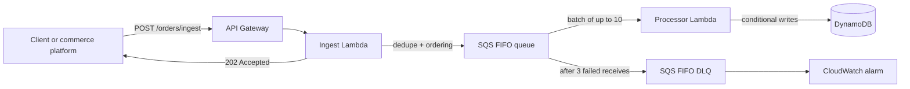

<h1 align="center">Joseph Rounds</h1>

  <strong>Senior Backend Engineer designing and building reliable cloud systems, SaaS integrations, and healthcare platforms</strong>

  
  
  
  
  
  
  
  

  <a href="https://www.linkedin.com/in/josephrounds">LinkedIn</a> ·
  <a href="https://www.lighthouseconsult.com">Lighthouse Consulting</a> ·
  <a href="mailto:jrounds@lighthouseconsult.com">Email</a>

I design and lead backend systems that move business-critical data safely between products. My work spans event-driven AWS services, API and webhook integrations, multi-tenant SaaS, and healthcare platforms built with Node.js/TypeScript and Python/Django.

Most of my production work is private because it belongs to employers and clients. The repositories below are focused reference implementations that demonstrate the same architecture, reliability, and security patterns without exposing proprietary code or data.

## Current focus

- **Cloud and event-driven architecture** — AWS Lambda, SQS/SNS, DynamoDB, retries, dead-letter handling, and observable asynchronous workflows
- **API and SaaS integrations** — OAuth, signed webhooks, idempotency, background processing, rate limits, and failure recovery
- **Healthcare technology** — secure backend services, benefits and third-party data integrations, auditability, and privacy-conscious system design
- **AI-native backend systems** — production-oriented tool calling and automation embedded in TypeScript services

## Flagship project

**[AWS Lambda Event Pipeline](https://github.com/dalerks/aws-lambda-event-pipeline)** — a production-oriented reference architecture for an event-driven order pipeline, built to the same standard as the systems I run for clients:

- Complete infrastructure as code in **AWS SAM**, with least-privilege IAM per function
- **GitHub Actions** CI running tests, coverage, TypeScript compilation, and SAM validation on every push
- **Jest** unit tests covering validation, partial-batch failures, conditional writes, and idempotency
- Documented **failure handling**: FIFO deduplication, DLQ after 3 retries, CloudWatch alarms, X-Ray tracing
- **OpenAPI 3.0** contract and an explicit security-scope section describing what a production fork still needs (auth, WAF, KMS, log redaction)

## Selected work

| Project | Stack |
|---|---|
| [Django Webhook Processor](https://github.com/dalerks/django-webhook-processor) | HMAC verification • Celery • Redis • PostgreSQL • Docker • tests |
| [Ecommerce Integration Starter](https://github.com/dalerks/ecommerce-integration-starter) | Next.js • TypeScript • Supabase • OAuth • webhooks • product sync |
| [Shopify Webhook Demo](https://github.com/dalerks/shopify-webhook-demo) | Shopify OAuth • webhook signatures • order processing |
| [AI Tool-Calling Demo](https://github.com/dalerks/ai-tool-calling-demo) | Node.js • TypeScript • multi-turn agent loop • typed tools |
| [Shop Admin Dashboard](https://github.com/dalerks/shopadmin-dashboard) | Next.js • TypeScript • ecommerce metrics • order workflows |

## Experience

- Lead and senior engineering experience across healthcare, travel SaaS, ecommerce, and consulting
- Backend systems built with **Node.js, TypeScript, Python, Django, PHP, PostgreSQL, Redis, and Celery**
- Cloud delivery with **AWS Lambda, SQS/SNS, DynamoDB, Docker, CI/CD, and infrastructure as code**
- Production integrations designed for high event volume, safe retries, traceability, and graceful failure recovery
- Founder of [Lighthouse Consulting](https://www.lighthouseconsult.com), helping organizations deliver custom software, ecommerce integrations, DevOps improvements, and automation

## Client work — case studies

- [HIPAA-Compliant Patient Portal →](https://www.lighthouseconsult.com/case-studies/healthcare-patient-portal/) — healthcare platform architecture, compliance, and privacy-conscious design
- [Legacy Storefront Re-Platform →](https://www.lighthouseconsult.com/case-studies/ecommerce-replatform/) — ecommerce migration, integration, and performance improvements
- [Order Management & Routing Platform →](https://www.lighthouseconsult.com/case-studies/logistics-order-management/) — logistics, event-driven order processing, and system design

More write-ups at [lighthouseconsult.com](https://www.lighthouseconsult.com/#case-studies).

## Engineering principles

- Make failure behavior explicit: validate inputs, preserve idempotency, retry safely, and surface actionable telemetry.
- Keep security and privacy in the design: least privilege, authenticated boundaries, secret management, and auditable operations.
- Treat tests, documentation, and delivery automation as part of the product—not cleanup work.
- Optimize for maintainability and business outcomes, not novelty.

  Open to consulting and contract work via
  <a href="https://www.upwork.com/freelancers/jrounds">Upwork</a>
  or <a href="mailto:jrounds@lighthouseconsult.com">directly</a>.

